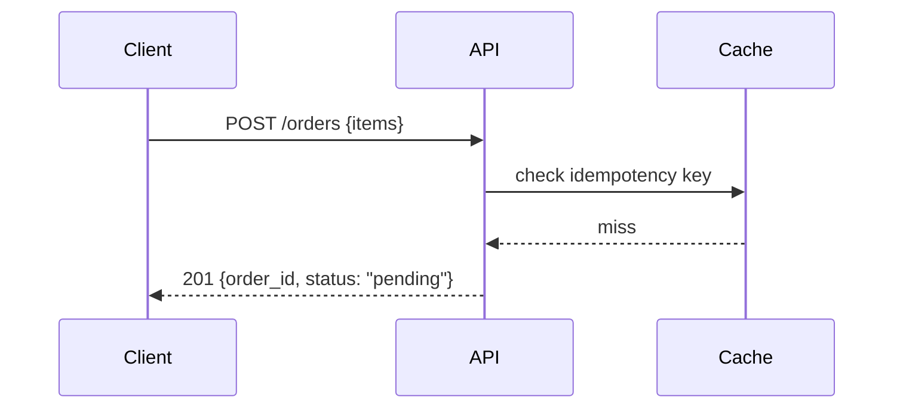
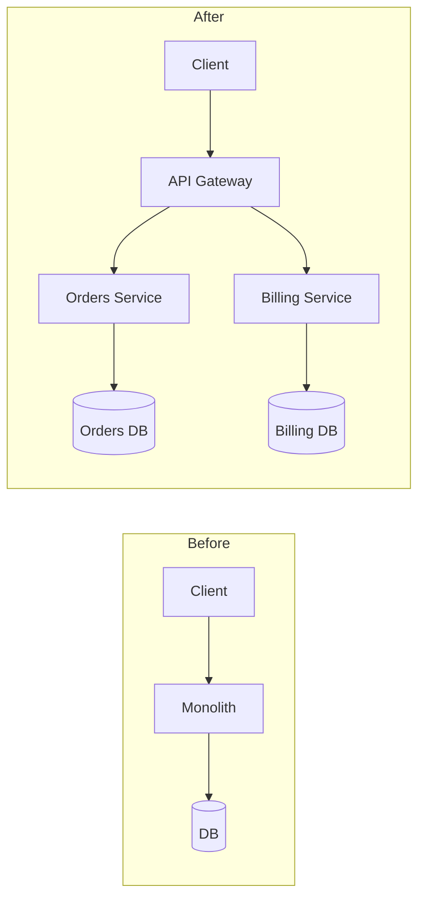
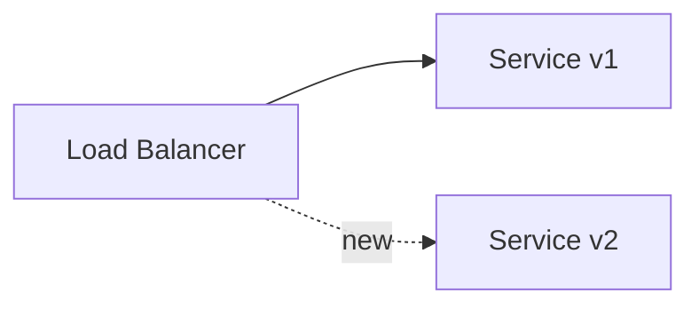

# Category playbook

Detail and worked examples backing `SKILL.md` step 2. One section per
category: what to capture, how, and a compact worked example of the
markdown to produce.

## UI

**What to capture:** the rendered result, not the code. Before (base ref)
and after (head ref) screenshots of the affected view, or a short GIF if
the change is a transition, hover state, or multi-step flow that a static
image can't convey.

**How:**
1. Use the `run` skill to start the app on the base ref. If you need the
   base ref checked out without disturbing the branch you're about to
   push, use a temporary `git worktree add /tmp/pr-base <base-sha>` and
   run the app from there.
2. Playwright (pre-installed Chromium) navigates to the affected page/
   component and screenshots it. Keep viewport size consistent between
   before/after so the composite lines up.
3. Repeat on the head ref in the normal working tree.
4. Remove the temporary worktree (`git worktree remove /tmp/pr-base`).
5. If both images are similar dimensions, run
   `scripts/compose_side_by_side.py before.png after.png out.png
   --labels Before After` and post one image instead of two.

**Worked example:**

```md
## Visuals


```

## API

**What to capture:** the request/response shape or flow, only when that
flow itself is the non-obvious part of the change. Don't diagram a
single-hop CRUD endpoint that doesn't need it.

**Worked example:**

````md
## Visuals



```json
// POST /orders
{"items": [{"sku": "ABC", "qty": 2}]}
// -> 201
{"order_id": "ord_123", "status": "pending"}
```
````

For a schema shape change, prefer a small before/after table over
prose:

```md
| Field | Before | After |
|---|---|---|
| `status` | `"ok" \| "error"` | `"pending" \| "confirmed" \| "failed"` |
```

## Architecture / design

**What to capture:** the structural change itself — new service, changed
data flow, module boundary shift. The diagram *is* the deliverable; no
screenshot is needed.

**Worked example:**

````md
## Visuals


````

## Tooling / CLI

**What to capture:** terminal output, before and after. This is already
the native artifact for a CLI change — resist the urge to screenshot text
that pastes cleanly as a code block. Only screenshot/GIF an actual
visual TUI (a curses-style interface, a progress dashboard with color/
layout that a text block would flatten).

**Worked example:**

````md
## Visuals

Before:
```
$ tool build
Error: config.yaml not found
```

After:
```
$ tool build
✓ built in 1.2s
```
````

## Infra

**What to capture:** the topology delta (what resources/services are
added, removed, or rewired) as a diagram, plus the tool's own plan/diff
output as supporting evidence — collapsed, since it's often long and the
diagram is what most reviewers actually need.

**Worked example:**

````md
## Visuals



<details>
<summary>terraform plan</summary>

```
+ aws_ecs_service.v2
~ aws_lb_listener_rule.main
```
</details>
````

## Docs / markdown

**What to capture:** the rendered preview, before and after — but only
when the change is structural (headings reorganized, a table added, a
diagram changed). For pure wording/typo edits, skip visuals; the text
diff already reads at a glance and a screenshot adds nothing.

**How:** render both versions (e.g. via the project's own doc-build step,
or a quick local markdown render) and screenshot with Playwright the same
way as a UI change.

## Other / pure logic

**What to capture:** nothing, by default. A tight bullet list of what
changed and why is the right amount of visualization here. Add a small
`mermaid` flowchart only if the control flow itself is genuinely hard to
follow from the diff — e.g. a state machine gaining a new transition —
never as decoration for a straightforward change.
