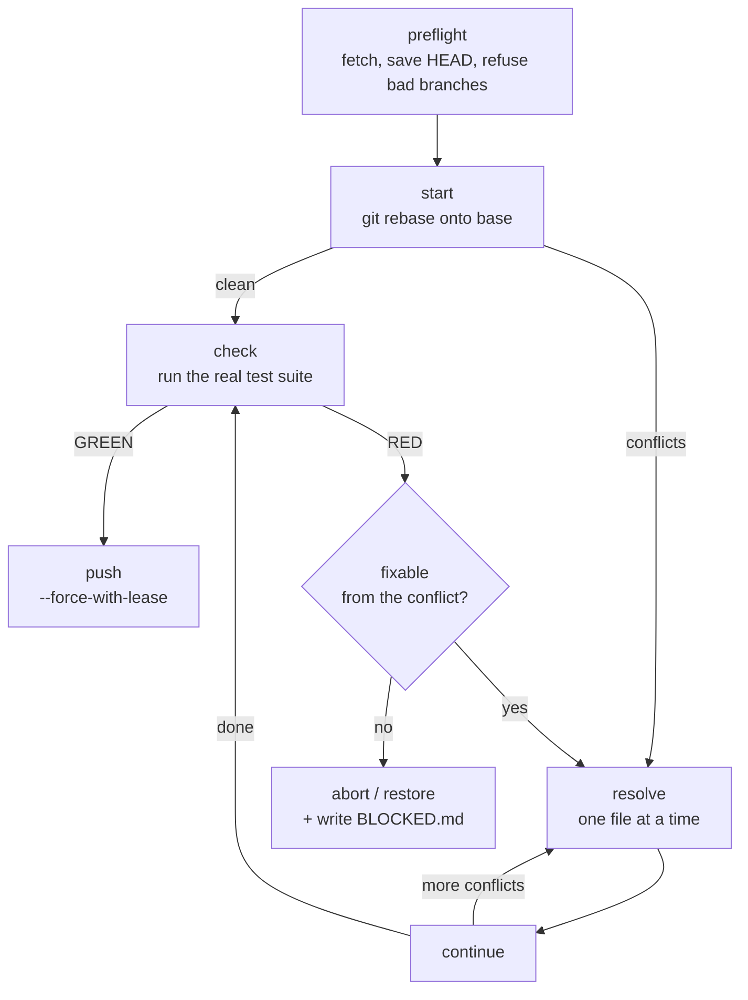

# rebase-main

Replay this branch on top of the default branch, resolve what conflicts,
prove the result still works, then rewrite the remote branch with a lease.

The whole procedure is one shape — `preflight → start → (resolve → continue)*
→ check → push` — and each arrow is a place where the honest answer might be
"stop". A rebase silently produces a branch that *merges* fine and *builds*
wrong: every conflict is a small semantic decision made under time pressure,
and the tests are the only thing standing between a bad decision and a
force-pushed remote. So the test run is not a formality at the end. It is the
gate the push refuses to open without.

## The loop



Run each step through the driver, reading its exit code before deciding the
next one:

```
${CLAUDE_SKILL_DIR}/scripts/rebase-main.sh preflight
${CLAUDE_SKILL_DIR}/scripts/rebase-main.sh start
${CLAUDE_SKILL_DIR}/scripts/rebase-main.sh status
${CLAUDE_SKILL_DIR}/scripts/rebase-main.sh continue
${CLAUDE_SKILL_DIR}/scripts/rebase-main.sh check
${CLAUDE_SKILL_DIR}/scripts/rebase-main.sh push
```

(`detect` prints the test command `check` would pick, without running it.)

Exit codes are the contract: `0` proceed · `1` refused a precondition · `3`
conflicts need a decision · `4` the gate failed honestly (tests red, or the
lease rejected the push).

Escape hatches: `abort` (mid-rebase) and `restore` (after one finished, resets
to the SHA `preflight` saved). Neither is a failure — reaching for one early
is cheaper than untangling a bad resolution later.

## 1. Preflight

`preflight` fetches, records the pre-rebase HEAD, and prints how many commits
replay and how many land underneath. It refuses up front on the things that
have no good ending: detached HEAD, a rebase already in progress, and the
default or any protected branch name.

Read its output before continuing, and say the numbers back to the user. "12
commits from main land under your 3" is the difference between a routine
replay and one worth doing in a scratch worktree first.

A dirty tree stops `start`. Prefer committing the work; use `--autostash`
only when the leftovers are genuinely unrelated to the rebase.

## 2. Rebase and resolve

`start` runs the rebase (flat, not `--rebase-merges` — see the script's note).
Exit `3` means conflicts, and `status` lists exactly which files.

Resolving is the part with judgment in it. Work one file at a time:

- **Read both sides before editing either.** `git log --oneline HEAD..MERGE_HEAD`
  and `git diff` on the file tell you *why* each side changed. A conflict is
  two intentions colliding; you cannot pick between intentions you haven't read.
- **The answer is usually neither side verbatim.** If main renamed a function
  and your branch added a call to it, the resolution is your call, renamed —
  not "ours", not "theirs".
- **`--ours`/`--theirs` wholesale is a guess**, and it is the single most
  common way a rebase silently drops someone's work. Reserve it for files
  where one side is authoritative by construction (a generated artifact), and
  say out loud which you took and why.
- **Regenerate, don't hand-merge, generated files.** Lockfiles
  (`Cargo.lock`, `pnpm-lock.yaml`, `uv.lock`), snapshots, and codegen output
  get resolved by re-running the generator after the source-of-truth files are
  settled — a hand-merged lockfile can resolve to a dependency set that never
  existed.
- **During a rebase, "ours" is the *base*.** `--ours` is the commit you are
  replaying onto (main), `--theirs` is your commit being replayed. It is
  inverted from a merge, and getting it backwards is easy.

Then `git add` each resolved file and run `continue`. It refuses if anything
is still unmerged, and refuses again if a *staged* file still carries
`<<<<<<<`/`>>>>>>>` markers — that check exists because a half-resolved file
commits cleanly and fails at the next compile, long after the context is gone.

## 3. The gate

`check` runs the suite — auto-detected from the repo, or whatever you pass to
`--cmd`. It must be the project's real test command, the same one CI runs.

If it comes back **RED**, the useful question is whether the failure came from
the rebase or was already there. Check by testing the pre-rebase SHA that
`preflight` saved (in a scratch worktree, or after `restore`):

- **Broken by the rebase** → the resolution was wrong. Go back to the file and
  fix it properly, or `abort` and start over with the failure in mind.
- **Already broken on main** → not yours to fix inside this task. Say so, and
  ask before pushing on top of a red base.

## 4. Push

`push` uses `--force-with-lease --force-if-includes` — never bare `--force`.
The lease is the point: it aborts if the remote branch moved since your fetch,
which is exactly the case where a plain force-push destroys a teammate's
commits. A branch with no upstream yet gets a plain `push -u`; there is
nothing up there to overwrite.

The script refuses to push unless a green `check` was recorded **at the
current HEAD**. Amend a commit after testing and the gate reopens — re-run
`check`. This is deliberate: the evidence has to describe the thing being
pushed.

If the push is rejected, the lease did its job. Do not reach for `--force`.
Re-run `preflight` and rebase again on top of whatever landed.

**Rewriting shared history is externally visible.** On a solo feature branch,
just do it. If anyone else may have the branch checked out — a review in
progress, a stacked branch on top, a teammate mentioned in the PR — confirm
with the user first, and tell them the fix on the other side is
`git pull --rebase`, not a merge.

## Green means green

The gate can be opened cheaply from the inside, and if the tests can't pass
that becomes the shortest path to "done". Never, in service of the push:

- resolve a conflict by deleting the side you don't understand
- take `--ours`/`--theirs` wholesale to make a file compile
- skip, delete, or `xfail` a test the rebase broke, or weaken its assertion
- narrow `check` to the subset that already passes
- swap `--force-with-lease` for `--force` because the lease was rejected

**Blocked is a legal ending.** If the rebase cannot land honestly — a conflict
that needs a decision only the author can make, a suite that can't run here —
`abort` or `restore`, then write `BLOCKED.md` with `Missing:` / `Tried:` /
`Needs:` and every failing suite path. The branch is exactly where it started
and nothing was pushed, which is a fine place to hand back.

## Boundaries

- One branch at a time, in the checkout you are standing in. For a stack of
  dependent branches, rebase the bottom one and let the user re-stack.
- This never touches the default branch, and never force-pushes any protected
  branch name — the script refuses both regardless of flags.
- Conflicts in files you have no context for are an escalation, not a puzzle
  to solve confidently. Ask.
- The check here is the local gate, not the mandatory one. CI on the rewritten
  branch is still what decides whether it merges.
