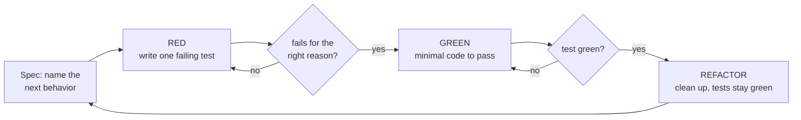

# tdd-loop

Test-Driven Development, run as an actual *loop* — "Loop Engineering". You
don't write code and hope; you write one failing test that pins down the
next slice of behavior, then loop on it until it's green, then clean up
with the test holding you in place. The point is a feedback cycle measured
in seconds, so the test — not a mental model of the code — is what tells
you where you are.

This is deterministic where it counts: a test either passes or fails, same
input, same result. That is what makes it a loop you can actually gate on.
The spec/test is written *before* the implementation, so the code is
checked against intent instead of the intent being reverse-engineered from
whatever the code happens to do.

## The loop



1. **Spec** — before touching code, name the single next behavior in one
   sentence (an input → expected output). Keep the slice small enough that
   one test captures it. For a non-trivial feature, list the behaviors
   up front (see `references/red-green-refactor.md`) and take them one at
   a time — that list *is* your lightweight spec.
2. **RED** — write exactly one test for that behavior and run it. It must
   fail, and fail for the *right reason* (assertion, not import error or
   typo). A test that passes immediately tested nothing new; a test that
   errors out tested your setup, not the behavior. Confirm the red is real
   before moving on.
3. **GREEN** — write the *minimum* code to make it pass. Not the elegant
   version, not the general version — the smallest change that turns the
   bar green. Resist building ahead of the test.
4. **REFACTOR** — with the test green as a safety net, clean up naming,
   duplication, and structure. Re-run; stay green. Refactoring without a
   green bar to fall back on is just editing.
5. Repeat for the next behavior.

## The watch runner

The tight loop needs the focused test to re-run on every save. Use the
runner:

```
.agents/skills/tdd-loop/scripts/tdd-loop.sh --watch -- <test command / focus>
```

- With no command it auto-detects the runner
  (`scripts/detect-test-runner.sh`) and runs the whole suite — fine to
  start, but **focus it** on the test you're driving for speed, e.g.:
  - `tdd-loop.sh --watch -- pytest tests/test_sync.py::test_retry`
  - `tdd-loop.sh --watch -- npx vitest run sync.test.ts`
  - `tdd-loop.sh --watch -- go test ./sync/ -run TestRetry`
- `--watch` re-runs on file changes (uses `entr`/`fswatch`/`inotifywait`
  if available, otherwise polls). Without `--watch` it runs once and exits
  with the suite's status — that form is what CI and the `commit-msg`/
  `pre-push` gates from `setup-git-hooks` call.
- Each run prints an unmistakable **RED** or **GREEN** banner and the raw
  runner output, so the loop state is never ambiguous.

### Driving it as an agent

When *you* are the one in the loop (implementing for the user), don't spawn
a background watcher you can't see — call the runner in **one-shot** mode
after each edit (`tdd-loop.sh -- <focus>`) and read the RED/GREEN result to
decide the next edit. That keeps the loop deterministic and observable
turn by turn. Reserve `--watch` for a human developer at the keyboard.

For long unattended runs ("keep going until the whole feature's suite is
green"), the built-in `/loop` skill can re-invoke `/tdd-loop` on an
interval — but prefer finishing the loop directly while you have context;
reach for `/loop` only when the work genuinely needs to span idle time.

## Where to point it

TDD earns its keep most on **logic with a clear input/output contract** —
parsers, serializers, state machines, pricing/financial rules, validation,
data transforms. That's also exactly where property-based testing pairs
well: once the example tests are green, assert the invariant ("encode then
decode returns the original") and let the framework generate inputs. See
`references/red-green-refactor.md` for per-ecosystem runners, focusing
syntax, and the spec/behavior-list template.

## Boundaries

- One failing test at a time. A pile of red tests is a backlog, not a
  loop — you lose the "fails for the right reason" signal.
- Don't over-fit the implementation to a single example. If two examples
  would force the real logic, write the second before generalizing.
- The loop is local and fast; it is not the gate. The mandatory gate is
  the same tests running green in CI (`.agents/conventions/README.md`). Keep the
  watch loop fast by focusing it; run the full suite in CI.
- Don't chase a coverage number for its own sake — TDD produces coverage as
  a byproduct. Coverage-that-asserts-nothing is what mutation testing
  exists to catch; that's a periodic audit, not part of this loop.
