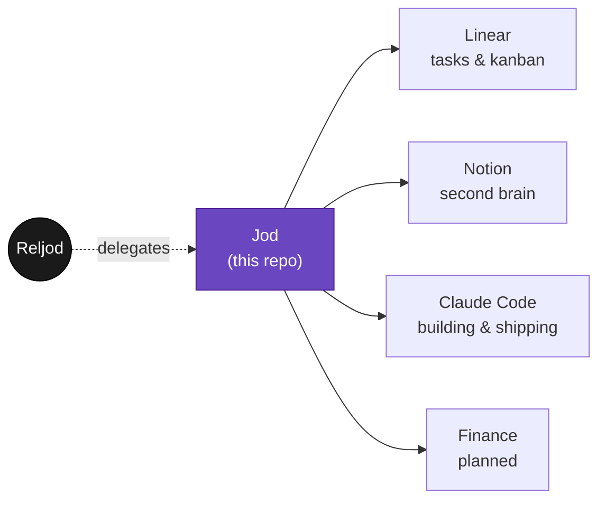

<div align="center">

```
     ██╗ ██████╗ ██████╗
     ██║██╔═══██╗██╔══██╗
     ██║██║   ██║██║  ██║
██   ██║██║   ██║██║  ██║
╚█████╔╝╚██████╔╝██████╔╝
 ╚════╝  ╚═════╝ ╚═════╝
```

**Reljod, duplicated.**

*An autonomous agent built to think, decide, and act the way he does —
whether or not he's at the keyboard.*

</div>

---

## What this is

Jod is not a product. It's infrastructure for one person — a standing
agent that mirrors how Reljod runs his own life and work, so the loop
keeps turning between the moments he's paying direct attention.

Most of the runtime lives in the Claude ecosystem — Claude Code for
building, the Claude Agent SDK for autonomy, Claude in Slack for reach —
wired into the tools where the real work already happens.



## Domains

| | Domain | System of record |
|---|---|---|
| 🗂️ | **Tasks** — what's in flight, what's next | [Linear](./domains/tasks) |
| 🧠 | **Second brain** — notes, reference, memory | [Notion](./domains/second-brain) |
| 💰 | **Finance** — money in, money out | *planned* ([notes](./domains/finance)) |

Each domain folder holds operating notes, not the data itself — Linear
stays the kanban, Notion stays the brain. This repo is the charter and the
glue.

## The toolkit

The *other* half is the reusable, project-agnostic layer — a set of Claude Code
skills under [`.agents/`](./.agents) that never reach into a personal domain.
Copy `.agents/` into any repo and the skills come with it. Design choices and
preferences (the WHYs) are kept slim in [`AGENTS.md`](./AGENTS.md), not a
separate doc.

### Install the toolkit on a new machine

One line, on any Linux or macOS box with `git`:

```sh
curl -fsSL https://raw.githubusercontent.com/Reljod/Jod/main/install.sh | bash
```

This clones the toolkit to `~/.jod` and links a `jod` CLI onto your `PATH`.
Then, in *any* repo on that machine:

```sh
cd ~/code/some-other-repo
jod setup-project --list
jod setup-project --preset jod --skills create-pr,setup-git-hooks,tdd-loop
```

`jod setup-project` scaffolds `AGENTS.md`/`CLAUDE.md` plus the chosen skills
straight into the current repo — no need to clone Jod itself into every
project. Re-run `install.sh` (or `jod update`) any time to pull the latest
toolkit changes. See [`bin/jod`](./bin/jod) and [`install.sh`](./install.sh)
for what each command does.

## Structure

```
AGENTS.md          the charter — identity, principles, slim WHY notes
CLAUDE.md          symlink -> AGENTS.md, so every runtime reads the same source
install.sh         curlable bootstrap: clones this repo, links the `jod` CLI
bin/jod            CLI shim — dispatches into .agents/skills/ from any repo
.agents/skills/    the portable toolkit — reusable Claude Code skills
domains/           personal operating notes, one per area of Reljod's life
```

Start with [`AGENTS.md`](./AGENTS.md) — it's the whole point.

---

<div align="center">
<sub>Built one delegated task at a time.</sub>
</div>
