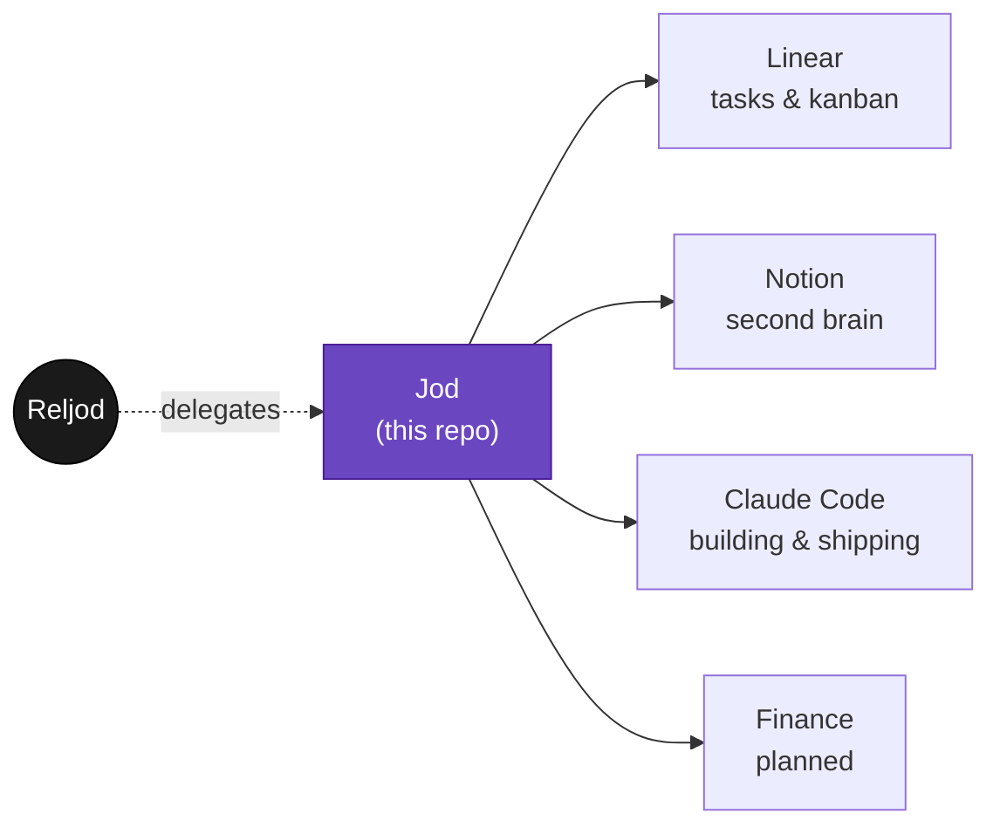

<div align="center">

```
     ██╗ ██████╗ ██████╗
     ██║██╔═══██╗██╔══██╗
     ██║██║   ██║██║  ██║
██   ██║██║   ██║██║  ██║
╚█████╔╝╚██████╔╝██████╔╝
 ╚════╝  ╚═════╝ ╚═════╝
```

**Reljod, duplicated.**

*An autonomous agent built to think, decide, and act the way he does —
whether or not he's at the keyboard.*

</div>

---

## What this is

Jod is not a product. It's infrastructure for one person — a standing
agent that mirrors how Reljod runs his own life and work, so the loop
keeps turning between the moments he's paying direct attention.

Most of the runtime lives in the Claude ecosystem — Claude Code for
building, the Claude Agent SDK for autonomy, Claude in Slack for reach —
wired into the tools where the real work already happens.



## Domains

| | Domain | System of record |
|---|---|---|
| 🗂️ | **Tasks** — what's in flight, what's next | [Linear](./domains/tasks) |
| 🧠 | **Second brain** — notes, reference, memory | [Notion](./domains/second-brain) |
| 💻 | **Coding** — everything built and shipped | [Claude Code](./domains/coding) |
| 💰 | **Finance** — money in, money out | *planned* ([notes](./domains/finance)) |

Each domain folder holds operating notes, not the data itself — Linear
stays the kanban, Notion stays the brain. This repo is the charter and the
glue.

## Structure

```
AGENTS.md      the charter — identity, principles, how this agent operates
CLAUDE.md      symlink -> AGENTS.md, so every runtime reads the same source
domains/       operating notes, one directory per area of Reljod's life
.agents/skills/ reusable Claude Code skills, promoted once proven
```

Start with [`AGENTS.md`](./AGENTS.md) — it's the whole point.

---

<div align="center">
<sub>Built one delegated task at a time.</sub>
</div>
