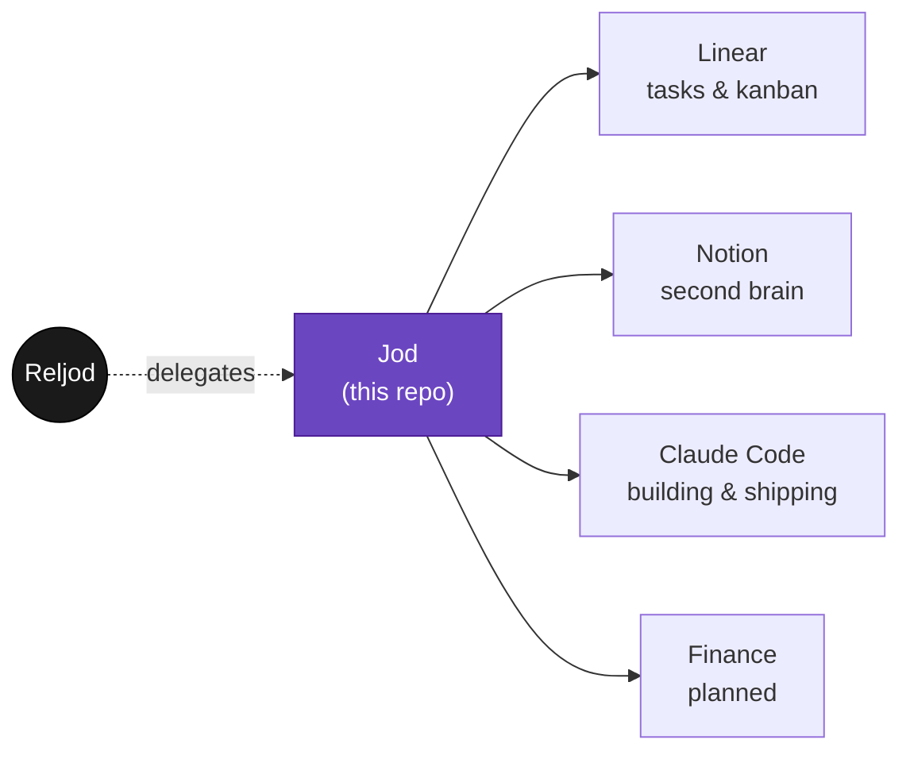

<div align="center">

```
     ██╗ ██████╗ ██████╗
     ██║██╔═══██╗██╔══██╗
     ██║██║   ██║██║  ██║
██   ██║██║   ██║██║  ██║
╚█████╔╝╚██████╔╝██████╔╝
 ╚════╝  ╚═════╝ ╚═════╝
```

**Reljod, duplicated.**

*An autonomous agent built to think, decide, and act the way he does —
whether or not he's at the keyboard.*

</div>

---

## What this is

Jod is not a product. It's infrastructure for one person — a standing
agent that mirrors how Reljod runs his own life and work, so the loop
keeps turning between the moments he's paying direct attention.

Most of the runtime lives in the Claude ecosystem — Claude Code for
building, the Claude Agent SDK for autonomy, Claude in Slack for reach —
wired into the tools where the real work already happens.


```mermaid
flowchart LR
    R((Reljod))
    J["Jod\n(this repo)"]

    R -. delegates .-> J

    J --> L[Linear\ntasks & kanban]
    J --> N[Notion\nsecond brain]
    J --> C[Claude Code\nbuilding & shipping]
    J --> F[Finance\nplanned]

    style J fill:#6b46c1,stroke:#4c1d95,color:#fff
    style R fill:#1a1a1a,stroke:#000,color:#fff
```

## Domains

| | Domain | System of record |
|---|---|---|
| 🗂️ | **Tasks** — what's in flight, what's next | [Linear](./domains/tasks) |
| 🧠 | **Second brain** — notes, reference, memory | [Notion](./domains/second-brain) |
| 💰 | **Finance** — money in, money out | *planned* ([notes](./domains/finance)) |

Each domain folder holds operating notes, not the data itself — Linear
stays the kanban, Notion stays the brain. This repo is the charter and the
glue.

## The toolkit

The *other* half is the reusable, project-agnostic layer — a set of Claude Code
skills under [`.agents/`](./.agents) that never reach into a personal domain.
Copy `.agents/` into any repo and the skills come with it.
[`AGENTS.md`](./AGENTS.md) holds the guidelines as bullets; the reasoning behind
them lives in [`docs/decisions.md`](./docs/decisions.md).

### Install the toolkit on a new machine

One line, on any Linux or macOS box with `git`:

```sh
curl -fsSL https://raw.githubusercontent.com/Reljod/Jod/main/install.sh | bash
```

This clones the toolkit to `~/.jod` and links a `jod` CLI onto your `PATH`.
Then, in *any* repo on that machine:

```sh
cd ~/code/some-other-repo
jod setup-project
```

That walks you through the setup in the terminal — **↑/↓** to move through
the behavior presets, **space** to toggle each skill on or off, **enter** to
confirm:

```
Behavior preset  ↑/↓ move · enter select · q cancel
  ❯ jod         the full Jod charter — layered quality gates, draft-PR habits
    minimal     lean identity + a few principles; grow it as needs get real
    tdd-strict  test-first enforced, coverage as a required CI gate
    team        Conventional Commits, PR/review norms — OSS & multi-contributor

Skills to copy in  ↑/↓ move · space toggle · a all · n none · enter confirm
  ❯ [x] create-pr        Build a visual-first PR description for the current change.
    [x] setup-git-hooks  Install deterministic local git hooks for a repo.
    [ ] tdd-loop         Build a feature or fix a bug test-first.
    [x] test-scenarios   Exhaustively test a unit — every scenario, every edge case.
    [x] write-spec       Interview, then write a SPEC.md a fresh session can execute.
```

Every choice is also a flag, so the same scaffold is scriptable — and with
no terminal attached (CI, a pipe) it prints the available presets/skills
instead of hanging on a prompt:

```sh
jod setup-project --list
jod setup-project --preset jod --skills create-pr,setup-git-hooks,tdd-loop
```

`jod setup-project` scaffolds `AGENTS.md`/`CLAUDE.md` plus the chosen skills
straight into the current repo — no need to clone Jod itself into every
project. See [`bin/jod`](./bin/jod) and [`install.sh`](./install.sh) for what
each command does.

#### Versioning and updates

Releases are tagged [Semantic Versioning](https://semver.org)
`vMAJOR.MINOR.PATCH`, cut manually from the **Release** GitHub Action
(Actions tab → Release → Run workflow → pick `patch`/`minor`/`major`) — it
gates on the test suites and an e2e scaffold-fitness check (`tests/e2e/`,
too expensive to run on every push), tags, and publishes a GitHub Release.

- **Install** always pins to the newest release by default. Ask for another
  version with `JOD_VERSION`:
  ```sh
  curl -fsSL .../install.sh | bash                      # latest release
  curl -fsSL .../install.sh | JOD_VERSION=v1.2.0 bash    # a specific release
  curl -fsSL .../install.sh | JOD_VERSION=main bash      # bleeding edge
  ```
- **`jod update`** only ever takes newer *patch* releases within the
  installed `MAJOR.MINOR` — it never jumps you to a new minor/major release
  on its own. To move to a new minor/major, re-run `install.sh` with the
  `JOD_VERSION` you want.
- **`jod version`** prints what's currently installed.

## Structure

```
AGENTS.md          the charter — identity, principles, conventions
CLAUDE.md          symlink -> AGENTS.md, so every runtime reads the same source
REVIEW.md          brief for the automated PR review — what to flag, what to ignore
docs/              the WHYs behind the charter's guidelines
install.sh         curlable bootstrap: clones this repo, links the `jod` CLI
bin/jod            CLI shim — dispatches into .agents/skills/ from any repo
.agents/skills/    the portable toolkit — reusable Claude Code skills
domains/           personal operating notes, one per area of Reljod's life
```

Start with [`AGENTS.md`](./AGENTS.md) — it's the whole point.

---

<div align="center">
<sub>Built one delegated task at a time.</sub>
</div>
