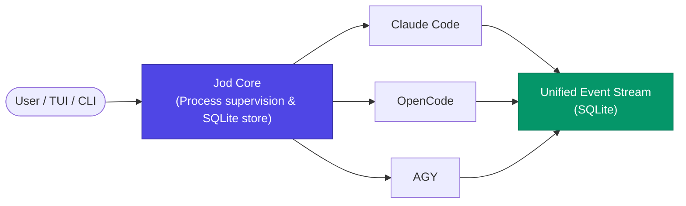

<div align="center">

```
     ██╗ ██████╗ ██████╗
     ██║██╔═══██╗██╔══██╗
     ██║██║   ██║██║  ██║
██   ██║██║   ██║██║  ██║
╚█████╔╝╚██████╔╝██████╔╝
 ╚════╝  ╚═════╝ ╚═════╝
```

**Autonomous multi-agent orchestration and terminal agent workspace.**

*Supervise, orchestrate, and delegate tasks across agent harnesses in one unified interface.*

</div>

---

## Overview

**Jod** is a standing multi-agent orchestrator built in Rust. It lives on your machine or VPS, supervising agent runs across supported harnesses (**Claude Code**, **OpenCode**, and **AGY**) and persisting every event, run, and memory into a single SQLite store.

Jod does not generate code itself - it delegates tasks to isolated agent harnesses running under process supervision (`jod-run`), normalizes their output into a unified event stream, and lets you manage, watch, and interact with all agents concurrently.


```mermaid
flowchart LR
    User(["User / TUI / CLI"])
    JodCore["Jod Core\n(Process supervision & SQLite store)"]

    User --> JodCore

    JodCore --> H1["Claude Code"]
    JodCore --> H2["OpenCode"]
    JodCore --> H3["AGY"]

    H1 --> Events["Unified Event Stream\n(SQLite)"]
    H2 --> Events
    H3 --> Events

    style JodCore fill:#4f46e5,stroke:#3730a3,color:#fff
    style Events fill:#059669,stroke:#047857,color:#fff
```

---

## Jod TUI (`jod tui`)

The centerpiece of Jod is `jod tui`: a rich, full-screen terminal interface designed for multi-agent delegation and monitoring.

```sh
jod tui
```

### Key Features of Jod TUI

- **Pinned Orchestrator Chat (`jod main`)**: The top row of the fleet view is permanently reserved for `jod main`. It is Jod's own orchestrator conversation that remains available across sessions. Pressing `Enter` on the top row enters the orchestrator chat, where you can issue meta-level instructions (delegation, scheduling, goal setting, agent inspection).
- **Fleet View (`Ctrl-A`)**: Toggle the fleet management panel listing every active and historical agent process group.
- **Background Delegation (`Ctrl-B`)**: Instantly delegate a prompt to a detached background agent process that runs independently and reports back upon completion.
- **Agent Interactivity**: Select any running or finished agent run from the panel to attach, view live transcripts, pause, resume, or terminate execution.
- **In-TUI Live Updates (`/update`)**: Trigger background binary updates from within the console. Build progress streams into the transcript, allowing you to re-exec into updated binaries without dropping your terminal session.

### Pinned Orchestrator Chat (`jod main`)

`jod main` is the single persistent orchestrator conversation. Rather than answering prompts directly, it uses Model Context Protocol (MCP) tools to act on your workspace:

| You say | Jod Main executes | Result |
|---|---|---|
| *"Every weekday at 8am, sweep open PRs"* | `schedule_create` | Armed recurring cron schedule |
| *"Keep refactoring until tests pass"* | `goal_create` | Persistent goal loop with automated checks |
| *"Build feature X"* | `delegate` | Spawns a new supervised agent run |
| *"Continue on that error"* | `continue_agent` | Resumes existing agent with full context |

---

## Core Features & Architecture

Jod is structured into decoupled Rust components:

| Component | Path | Function |
|---|---|---|
| **Core Engine** | [`core/`](./core) | Harness abstractions, SQLite event logging, memory management, and MCP tools |
| **Supervisor** | [`supervisor/`](./supervisor) | `jod-run`: Process group supervisor managing agent execution and stdout/stderr normalization |
| **CLI & TUI** | [`cli/`](./cli) | `jod` binary offering terminal commands and full-screen TUI interface |
| **HTTP Daemon** | [`api/`](./api) | `jod-api`: Optional REST daemon providing remote access to the SQLite event store |

### Unified Event Stream & Process Supervision

Every delegated run is executed in its own detached process group managed by `jod-run`. If the TUI exits or your terminal disconnects, background agent tasks continue uninterrupted. Every tool call, prompt turn, stdout line, and exit state is recorded in `$HOME/.jod/jod.sqlite`.

---

## CLI Usage

```sh
# Start the full-screen terminal interface
jod tui

# Talk directly to the pinned orchestrator conversation
jod main "check status of current background runs"

# Delegate a single prompt directly to an agent harness
jod run "summarize git changes in this directory"

# Start a simple terminal chat
jod chat

# Query Jod memory and past run context
jod recall "what were the test results for the last PR?"

# Check available agent harnesses on your system
jod harnesses

# Update Jod binaries to the latest patch release
jod update
```

---

## Installation

Install Jod with a single command on Linux or macOS (requires Git and [Rust](https://rustup.rs)):

```sh
curl -fsSL https://raw.githubusercontent.com/Reljod/Jod/main/install.sh | bash
```

The installer:
1. Clones the source into `$HOME/.jod/src` (or `$JOD_SRC`).
2. Validates buildable releases and compiles Rust binaries (`jod` and `jod-run`).
3. Installs binaries into `$HOME/.local/bin` (or `$JOD_BIN_DIR`).

### Optional HTTP Daemon (`jod-api`)

To build and install the optional HTTP daemon alongside the CLI and supervisor:

```sh
curl -fsSL https://raw.githubusercontent.com/Reljod/Jod/main/install.sh | JOD_WITH_API=1 bash
```

See [`deploy/README.md`](./deploy/README.md) for deployment and daemon setup options.

---

## Portable Skills Toolkit & Plugin

Jod includes a reusable, project-agnostic toolkit under [`.agents/skills/`](./.agents/skills) for workflow automation (PR creation, spec writing, TDD loops, scenario testing, and git hooks).

### Installing as a Claude Code Plugin

Register the catalog and install the plugin:

```sh
/plugin marketplace add Reljod/Jod
/plugin install jod@reljod
/reload-plugins
```

This brings slash commands directly into your Claude Code workflow:
- `/jod:write-spec` - Interactive spec generator prior to implementation
- `/jod:create-pr` - Rich PR description generator with visual deltas
- `/jod:tdd-loop` - Red-green-refactor TDD watch loop
- `/jod:test-scenarios` - Exhaustive edge-case test coverage auditing
- `/jod:setup-git-hooks` - Deterministic pre-commit/pre-push git hooks installer
- `/jod:setup-project` - Interactive repository charter & skills bootstrapper

---

## Repository Layout

```
AGENTS.md          Charter, coding conventions, and agent rules
CLAUDE.md          Symlink to AGENTS.md for Claude integration
install.sh         Bootstrap installer script for Jod
core/              Rust core: process supervision, SQLite store, events, MCP tools
supervisor/        jod-run supervisor daemon
cli/               jod CLI and full-screen TUI implementation
api/               jod-api HTTP server
.agents/skills/    Portable agent skills and slash commands
apps/              Desktop, mobile, web, and voice client applications
docs/              Architecture specs and decision documentation
```

---

<div align="center">
<sub>Built for autonomous multi-agent orchestration.</sub>
</div>
